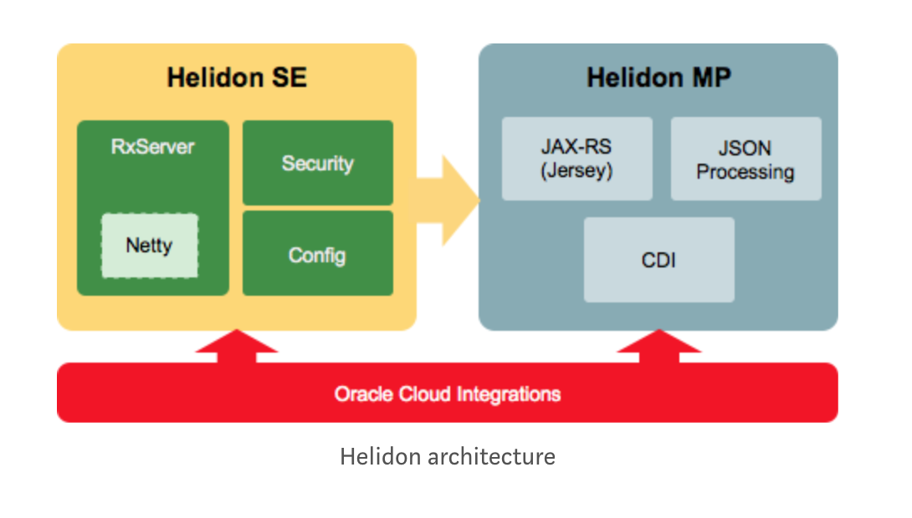

# Testing MicroProfile

Testing Oracle's helidon framework 

# Architecture

# Category

# Package

    make package
    
# Run

[Standard Edition](quickstart-se/)
    
    make run-se
    
    
[MicroProfile](quickstart-mp/)    

    make run-mp

Access http://localhost:8080/greet

CTRL+C to stop

    
# Ref

* [oracle-introduces-helidon](https://www.infoq.com/br/news/2019/01/oracle-introduces-helidon)

* [Helidon](https://helidon.io)

* [Talk about Helidon](https://www.youtube.com/watch?v=SDI6ci2XsCQ)